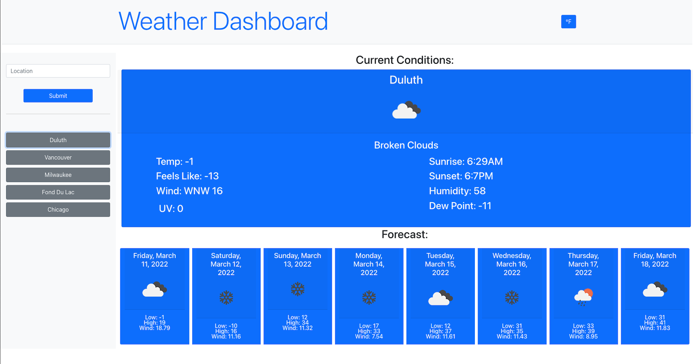

# Weather Dashboard

## Table of Contents

- [Description](#description)
- [Available Scripts](#available-scripts)
- [Screenshot](#screenshot)
- [Link](#link)
- [Code](#code)
- [Contact](#contact)
- [Technologies](#technologies)
- [Project Status](#project-status)

## Description

A weather dashboard built with React that allows the user to search for a location and be presented with current weather conditions and a five-day forecast. Previous search locations are added to the interface to allow for future searches with a single click. Duplicate entries are not saved. Supports both Fahrenheit and Celsius, with user preference saved to local storage.

## Available Scripts

In the project directory, you can run:

### `npm start`

Runs the app in the development mode.\
Open [http://localhost:3000](http://localhost:3000) to view it in your browser.

The page will reload when you make changes.\
You may also see any lint errors in the console.

## Screenshot

## Link

[Weather Dash React](https://johny49.github.io/weather-dash-react)  
Standard, non-React version
[available here.](https://johny49.github.io/weather-dashboard/)

## Code

[GitHub Code Repository](https://github.com/Johny49/weather-dash-react)  
Standard, non-React version
[available here.](https://github.com/Johny49/weather-dashboard)

## Contact

Created by [@johny49](https://github.com/Johny49/) - feel free to contact me!

## Technologies

- React
- JavaScript
- Bootstrap
- Open Weather One Call and Geocoding APIs

## Project Status

Project is: completed and functioning with possible future improvements.
